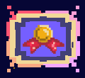

<h1 align="center">Mori Bazius (front-end)</h1>

---

**Mori Bazius** is a _2D fantasy clicker game_ for mobile devices. It was developed as a project for Software Architecture and Big Data courses. This repository contains front-end part of the project. Back-end repository can be found [here](https://github.com/Adeon18/Mori-Bazius-Backend).

The main idea of the game is to farm resources and reach rank 1 in the leaderboard. Player should click on basic resources, craft them with each other and upgrade. Use the new items to equip hunters and fight monsters.

<h2 align="center">Overview</h2>

There are _2 metrics_ to estimate the player _progress_ in the game:

1. **Power**  : each item and hunter has its own power. The total power of the player is a sum of individual powers of all items he has.
2. **Level**  : the only way to gain experience points is to kill monsters. For that, player should equip or upgrade his hunters. During a fight, hunters can die, and the total power is thus reduces, so the player should find a balance of the optimal level and power gaining strategies.

---

Game provides many resource types to farm. They can be divided onto _3 types_:
1. **Basic**  : click as many as you like and gain respective amount of resource.
2. **Crafted**  : use basic resources combinations to farm more complex items.
3. **Upgrades**  : upgrade your already crafted item to make them even stronger.

---

The _resources_ themselves are of different realms depending on the context:
- [x] **Herbs**    : the basic types to be collected and then used to mix the potions
- [x] **Potions**  : craftables that are required for hunters to equip
- [x] **Minerals**     : many basic ores that are later used to craft the ingots
- [x] **Metals**    : craft ingots to be used for hunter's weapons
- [x] **Swords**     : each hunter requires both silver and steel sword; upgrades available
- [x] **Armor**   : one armor plate is required for a hunter; can be upgraded
- [ ] **Shooting weapons**: crossbow and pikes to be used in range attacks

---

To fight monsters there are _2 kinds_ of troops:
- [x] **Hunters**  : the regular recruits
- [x] **Masters**  : upgraded troops requiring better equipment and providing better win rate in a fight

---

Also there are different monsters available:
- [x] **Bruxa**  : the least dangerous one yet providing only 1 experience point on kill
- [x] **Kikimora**  : stronger monster with a bit higher reward
- [x] **Wyvern**  : the most dangerous one, hard to kill and gives many experience points

---

Players can compare their game progress using the **Leaderboard**  : a ranking system providing top-most players and their stats.

<h2 align="center">Mechanics</h2>

**Main mechanics** intended:

- [x] Registration and login pages
- [x] Clickable resources
- [x] Craftable resources
- [x] Saving system of the game progress
- [x] Hunters recruitment
- [x] Fighting monsters
- [x] Leaderboard
- [ ] Different schools of hunters to be chosen on account creation
- [x] Guilds for the same schools of players
- [ ] Guild wars between different kinds of hunters
- [ ] Trading system between players
- [ ] Dynamic content based on the player's progress (new resources, monsters)

<h2 align="center">Contributors</h2>

Team **«Hoydalka»**:
* [Ostap Trush](https://github.com/Adeon18)
* [Oleksiy Hoyev](https://github.com/alexg-lviv)
* [Bohdan Ruban](https://github.com/iamthewalrus67)
* [Alina Bondarets](https://github.com/alorthius)
* [Oleksandra Stasiuk](https://github.com/oleksadobush)
